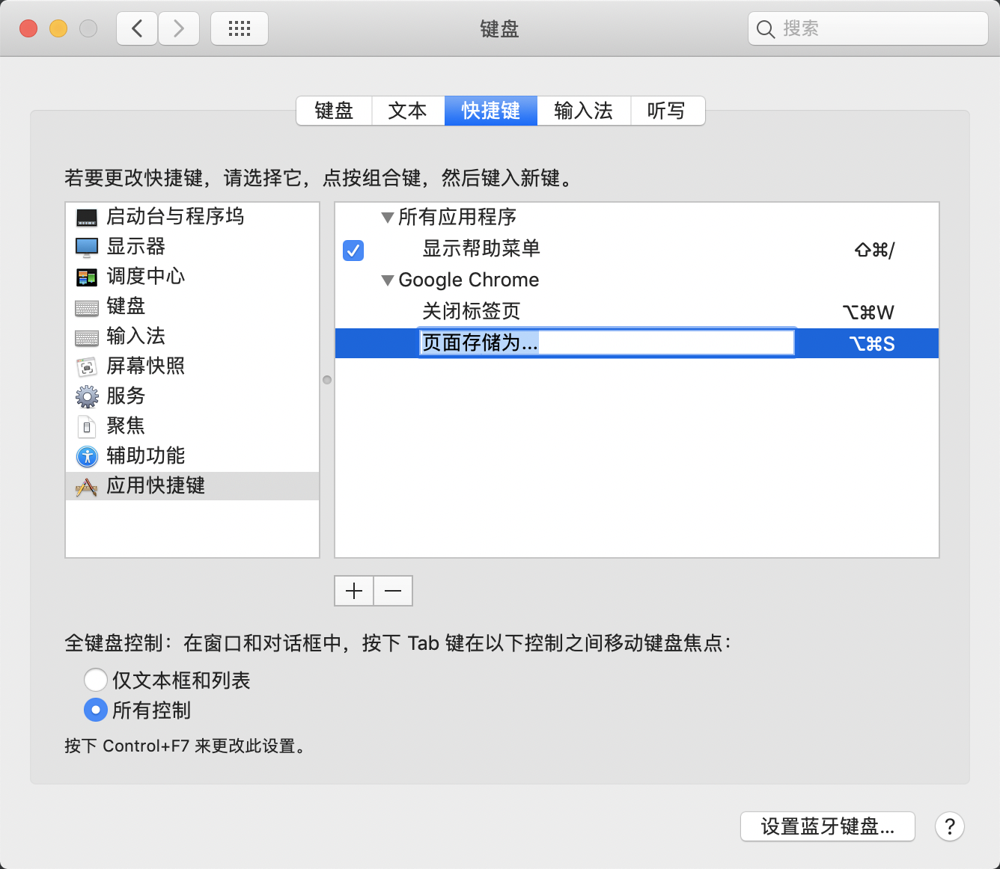

# 快捷键

我喜欢鼠标定位，有些同学喜欢键盘定位的，这是纯习惯问题。所以我会把一些定位相关的功能放在鼠标自定义键上，方便操作。

__鼠标__

| 鼠标快捷键 | 说明 | 位置 |
| --- | --- | --- |
| `⌃⇧⇥`, `⌃⇥` | Chrome `选择上/下一个标签`, WebStorm `Close Others/Switcher`(注) | 中键两侧 |
| `⌃→`, `⌃←` | 控制 Mac 多桌面（用的较少） | 左键左侧 |
| `⌥⌘D` | `展示/隐藏` 程序坞 | 拇指上方靠前 |
| `⌃↑` | 窗口切换 | 拇指上方靠后 |

> `Close Others` 可以关闭所有打开的文件，只留当前一个， `Switcher` 可以切换至最近用的那个文件，这样我就可以很方便的同时修改多个文件。另外可以考虑的是 `Select Previous Tab` 和 `Select Next Tab`，和 Chrome 的体验一致。

__Chrome__

我禁用了 `⌘W` 和 `⌘S`，在 WebStorm 频繁使用这两个键，到了 Chrome 经常误触。关于 Chrome 如何更改快捷键可以看去年的文章。另外，我开启了 `⌘1~9` 快速切换的功能，有两个用，一个是你可以有一些习惯，比如你的第一个标签一直是 `localhost`，你就可以 `⌘1` 过去。另一个是在开发者工具里切换 `Element`, `Console` 之类，它们的位置是固定的。

如果有能力完全可以根据 Chrome 多到数不清的文档定制你自己的功能。

__WebStorm__

Theme 用的 Darcula，Scheme 是在 Darcula 基础上自己配的，主要是为了调整对不同代码的注意力。不过这个不要投入太多精力，毕竟 WebStorm 也在升级。说到 Webstorm 的升级，我觉得最好的策略是使用最新的 stable 版本，每个版本的功能或多或少会有惊喜，但同样因为功能多的原因，预发布不会特别稳定。

另外有一个特别推荐的功能，即 Live Templates 功能，在你输入特定的字符，就可以进入 template 过程，整个行文的思路也完全由你控制。

| 常用的一些快捷键 | 说明 |
| --- | --- |
| `⌘A`, `⌘X`, `⌘C`, `⌘V` | 全选，剪切，复制，粘贴 |
| `⌘F`, `⌘R` | 查找，替换 |
| `⌘Z`, `⌘Y` | 撤销，重复 |
| `⌘Q` | 下一处待处理的位置 |
| `⌘W` | eslint --fix |
| `⌘E` | 收起代码块 |
| `⌘U` | 切换选中文字大小写 |
| `⌘D` | 删除单行 |
| `⌘G` | 查找 usage |
| `⌘H` | 全局查找 |
| `⌘J` | 多行合并 |
| 双击 `⇧` | 跳转文件 |
| `⌥`, `⌥↑`, `⌥↓` | 多光标 |
| `F2` | 重命名 |
| `⌥⌘M` | 抽出函数 |

| 常用的一些 Live Template | 说明 |
| --- | --- |
| im | import {b} from 'a'; |
| cl | console.log(a); |
| Se | Sentry.captureMessage(a); |

__鼠标示意图__

__禁用应用快捷键__

